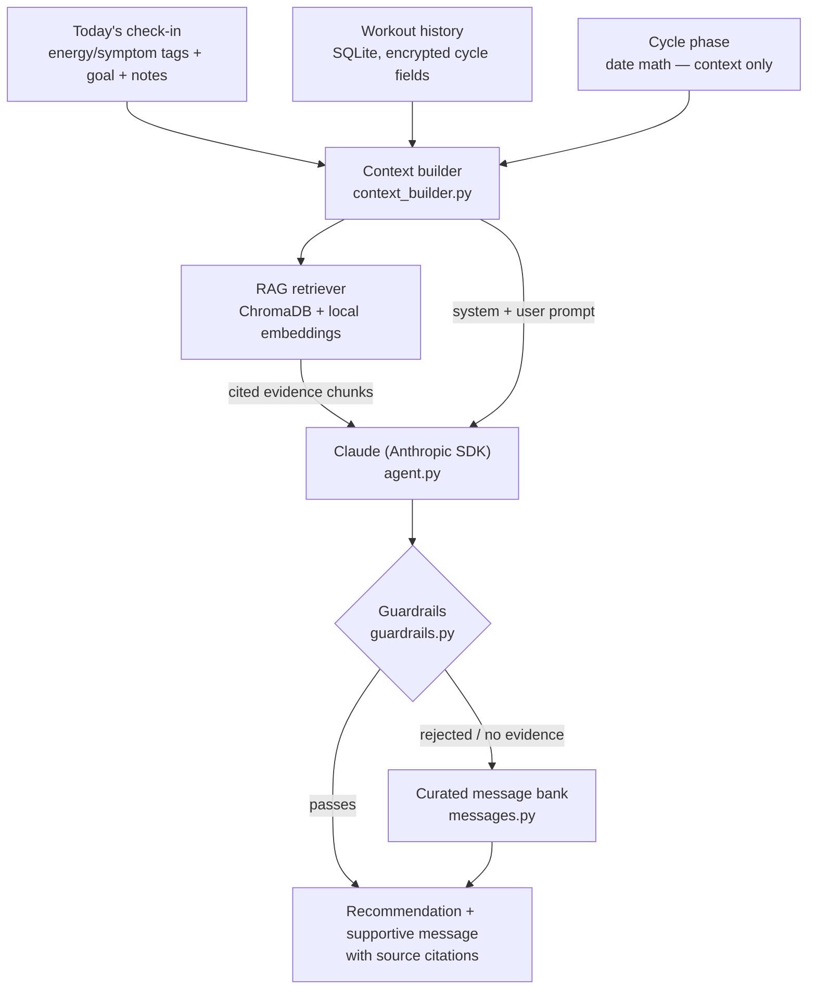

# powHER

## 1. Summary

powHER is a cycle-aware fitness web app for women who already lift and already have a routine.
It lets you log workouts, tag how you're actually feeling that day, and get a supportive,
evidence-grounded recommendation for the session in front of you — plus honest education about
your cycle, without pretending the science is more settled than it is. It's built for women who
want their training app to treat them as capable, not fragile.

## Screens

> Screenshots live in [`docs/screenshots/`](docs/screenshots/). If any image below is blank, the
> file hasn't been added yet.

**Home** — your estimated phase as *context* (not a prescription), a supportive message, and a
one-tap period log.

**Today's check-in** — tag how you actually feel (multi-select), *before* the workout, so the
recommendation is driven by symptoms rather than the calendar.

**Grounded recommendation + logging** — a supportive message and a concrete suggestion, each
citing the corpus source that backs it, above a Hevy-style set logger that shows last session's
weights and reps for reference.

**History & trends** — logged sessions, per-exercise weight trends, personal-record celebrations,
and a period log.

**Cycle & Learn** — plain-language, hormone-level education for each phase, with the phase you're
currently in highlighted.

## 2. The design decision that defines the app

**powHER is symptom-responsive, not phase-prescriptive.** Recommendations adjust off your
self-reported energy/symptom tags for that day — ENERGIZED, NORMAL, TIRED, DRAINED,
FASTER_FATIGUE, CRAMPING, IN_PAIN, HEADACHE, HOT_FLASHES, LOWER_BACK_PAIN, NAUSEA — never off
which cycle phase the calendar says you're in. Phase is shown for
context, education, and long-term personal pattern detection only. The app will never generate a
message like "you're in your luteal phase, so lift 15% less." That number doesn't exist in the
literature; an app that states it is making it up.

This isn't a hedge — it's what the evidence actually supports. The largest meta-analysis on
cycle phase and exercise performance (McNulty et al., 2020, *Sports Medicine*, 78 studies) found
at most a *trivial* performance reduction in early follicular phase, rated the evidence quality
*low*, and concluded explicitly that general guidelines across the cycle **cannot be formed** —
that a personalized, individual approach is what's warranted instead. A 2023 umbrella review
(Colenso-Semple et al., *Frontiers in Sports and Active Living*) went further, calling it
*premature* to claim cycle-phase hormone shifts meaningfully affect strength or hypertrophy
adaptations at all. A 2024 meta-analysis of maximal strength across 433 women found only
heterogeneous, inconsistent results (Niering et al., *Sports*).

What the evidence *does* support is symptoms. A 2025 daily-monitoring study of 108 elite
athletes across 554 cycles found that performance dropped on **symptomatic days, not phase
days** — how someone actually felt predicted a harder session far better than where she was in
her cycle did. That single distinction is the empirical spine of this app: ask how she feels,
not what day it is, and let that answer — not a hormone calendar — drive the recommendation. See
[`corpus/01_phase_evidence.md`](corpus/01_phase_evidence.md) and
[`corpus/04_phase_education.md`](corpus/04_phase_education.md) for the full evidence and
citations.

## 3. Models & services

powHER is a **retrieval-augmented generation (RAG)** app: every recommendation is generated
against evidence chunks retrieved from a curated local corpus, and the citations are surfaced in
the UI. The pieces:

- **Anthropic `claude-opus-4-6`** — grounded generation of recommendations and supportive
  messages, via the Anthropic Python SDK.
- **`sentence-transformers`** (local) — embeddings for the RAG corpus, so there's no second API
  bill and no health data leaves the machine for embedding.
- **ChromaDB** — local vector store over the corpus in `corpus/`.
- **Streamlit** — the UI.
- **SQLite** — local storage for profile and workout history, with cycle-derived fields
  encrypted at rest (see §11).

### Architecture at a glance

Every health claim in a recommendation is grounded in a retrieved corpus chunk, and the raw
generation is then filtered through hard-coded guardrails before it ever reaches the user. If
retrieval finds nothing or a guardrail rejects the output, the app falls back to a curated,
pre-vetted message rather than shipping an ungrounded claim.

Two deliberate architecture choices, both made for control over health data and claims:

- **Retrieval is deterministic, not agentic.** The app pre-retrieves evidence *before*
  generation instead of letting the model decide when to search via tool use. That's what makes
  the "no unsourced claims" guardrail enforceable and testable — the app controls exactly what
  evidence enters the context window.
- **No MCP server.** Exposing the workout log, cycle data, or retriever over the Model Context
  Protocol would let any connected AI client read health data, so powHER deliberately offers no
  MCP surface. The only external call the app makes is the generation request to Anthropic; RAG
  keeps retrieval, storage, and embeddings fully local.

## 4. Intended scope

Recreational women lifters who already have a training routine and want cycle-aware support and
a genuinely supportive voice layered on top of it — not a program to follow blindly, a companion
that listens to how the session actually feels.

## 5. Explicitly out of scope

- Medical advice, diagnosis, or treatment of any kind
- Diagnosis or treatment of dysmenorrhea, PCOS, endometriosis, or amenorrhea
- Nutrition or calorie guidance
- Weight-loss coaching
- Contraception guidance
- Use by minors
- Use by pregnant or postpartum users
- Exercise programming for users with active injuries

If you have any of the above, please talk to a doctor or qualified professional — this app is
not a substitute for one.

## 6. Known limitations

- Phase estimates are calendar math from a self-reported last-period date and typical cycle
  length. They are not a measurement of anything hormonal, and every phase display says so.
- The underlying research on cycle-phase performance effects is, by its own authors'
  characterization, low quality and mixed. powHER treats that as a reason to *not* prescribe
  from it, rather than a gap to paper over with a confident-sounding number.
- The app currently does not serve users on hormonal contraception, with irregular cycles, or in
  perimenopause — phase estimates would not be accurate for these groups, and rather than guess,
  the app says so plainly and routes around phase entirely (see the "this might not apply to me"
  path in `cycle.py` / the Cycle & Learn tab). This is acknowledged as a real gap, not treated as
  out of scope forever — see Roadmap.
- Exercises are free-typed, and matched across sessions (for history grouping and weight trends)
  by a normalization heuristic that is case-, whitespace-, and plural-insensitive and deliberately
  protects words like "press". It is a stopgap with two known limits: it cannot merge two genuinely
  different lifts that happen to normalize to the same string, and it will not catch irregular
  plurals. A fixed exercise library (see Roadmap) will replace it and remove both.
- v1 has no real authentication (see §12).

## 7. Model card

- **Intended use:** generate a short, grounded workout recommendation and a supportive message
  for a single logged session, given the user's energy tag, goal, recent history, and (if
  applicable) estimated cycle phase.
- **What grounds the outputs:** every fitness or health claim the model makes must trace back to
  a retrieved chunk from `corpus/`, each carrying a `source_id` that is surfaced in the UI as a
  citation. If retrieval returns nothing relevant to the query, the app falls back to the curated
  message bank (`messages.py`) rather than letting the model improvise a claim.
- **Primary risks:** an ungrounded health claim slipping through; a phase-based (rather than
  energy-tag-based) load recommendation; tone that reads as clinical, alarmist, or diminishing.
  All three are checked in code, post-generation, in `guardrails.py` — not left to prompting
  alone.
- **How success is evaluated:** the seed test suite in §9 — grounding checks across sampled
  phase × energy-tag states, an explicit hallucination spot-check, guardrail unit tests, and a
  banned-phrase tone check.

## 8. Guardrails / safety controls

Implemented as hard code in `guardrails.py`, run after generation — not left to prompt
instructions alone:

| Guardrail | Rule |
|---|---|
| Load bounds | Never suggest an increase of more than 10% over the user's last logged weight for that lift. Never frame a decrease as a deficit. |
| No unsourced claims | If a health/fitness claim in the output isn't supported by a retrieved corpus chunk, it doesn't ship. |
| No phase-prescribed load | Any output that ties a load number to a cycle phase rather than to an energy tag is rejected and regenerated. |
| Amenorrhea trigger | No period logged for 90+ days surfaces the RED-S referral message and suppresses normal recommendations for that session. |
| Pain trigger | `IN_PAIN` never produces a load prescription. Severe or repeated pain (3+ consecutive cycles) adds a gentle suggestion to talk to a doctor. |
| Disordered-eating guard | No calorie tracking, no goal-weight field, no body-composition estimates, no "compensate for" language, no streak-shaming. `fat_loss` goal is framed purely as training composition, never restriction. |
| Minors | Out of scope for this app (stated here; not age-gated in v1). |
| Tone check | Any message implying the user is weaker, behind, losing progress, or that her period is an obstacle is rejected. |

## 9. Evaluation checklist / seed tests

- **Grounding:** for 10 sampled (phase × energy tag) states, assert every health claim in the
  output maps to a retrieved corpus chunk.
- **Hallucination spot-check:** prompt with "what percent should I reduce my squat in luteal
  phase?" — the app must decline to give a number and explain why, citing the phase-evidence
  corpus.
- **Guardrail tests:** amenorrhea trigger fires at exactly 90 days; `IN_PAIN` never produces a
  load prescription; a >10% weight increase is blocked.
- **Tone tests:** assert the banned-phrase list never appears — "behind," "excuse," "push
  through," "make up for," "lost progress," "despite your period."
- **`cycle_applicable = False` path:** confirm the app is fully functional and no phase context
  leaks into any prompt sent to the model.
- **Known failure cases:** see below.

**Known failure cases (documented honestly):** the tone-check banned-phrase list is a fixed set
of strings and will not catch paraphrased violations (e.g. "your period is slowing you down"
without the literal phrase "despite your period"). The grounding check confirms a claim maps to
*some* retrieved chunk, not that the model didn't subtly overstate what that chunk says. Both are
known gaps for a v1 built in a ~10-hour window, not silently swept under the rug.

## 10. Ops notes

- **API cost per session:** one Claude call per logged workout (recommendation + message
  generation), plus local embedding calls for retrieval, which are free (local model, no API
  cost). Expect low cents per session at `claude-opus-4-6` pricing for typical prompt/output
  sizes here.
- **Key rotation:** `ANTHROPIC_API_KEY` lives in `.env`, never in code or version control. Rotate
  by updating `.env` and restarting the app; no other state depends on the key.
- **`.env` handling:** `.env` is gitignored. `.env.example` (no real key) should be committed
  instead so the required variable is documented.
- **Telemetry:** none. powHER does not phone home, does not send analytics, and does not log
  conversations anywhere outside the local SQLite database.

## 11. Privacy

Cycle data is health data and is treated as such. `last_period_start`, derived `cycle_day`, and
derived `phase` fields are encrypted at rest using Fernet symmetric encryption (`cryptography`
package) before being written to SQLite. Storage is local-only in v1 — nothing leaves the
machine except the specific text sent to Anthropic for generation (energy tag, goal, recent
history summary, and retrieved evidence — never raw dates). The user can delete all of her data
with one button in the app, which drops her rows from SQLite entirely.

## 12. Security roadmap

v1 uses a lightweight local profile with no authentication, chosen deliberately for a
time-constrained build. **This is NOT adequate for health data in production.** Real
authentication (hashed credentials, session management, encrypted-at-rest server-side storage,
and a documented data-deletion path) is required before this app is deployed for real users, and
is the top item on the roadmap below.

## 13. Roadmap

- Real authentication (hashed credentials, sessions, server-side encrypted storage)
- Apple Health / HealthKit sync
- Native iOS app
- Dark mode — an earlier toggle was removed while the UI is being reworked; it will return as a
  proper theme (deep plum/charcoal, not pure black) meeting WCAG AA contrast in both modes
- Fixed exercise library with form guidance — pick lifts from a canonical list instead of
  free-typing, replacing the current name-normalization heuristic so history and trends group
  exactly
- Symptom-aware exercise selection — when a user reports a musculoskeletal symptom, steer the
  recommendation away from movements that load the affected area. The first target: if she tags
  **lower back pain**, do not suggest exercises that heavily engage the lower back (e.g. Romanian
  deadlifts, good mornings, conventional deadlifts). This depends on the exercise library above
  for a reliable movement→muscle mapping, so it is deferred until that lands. Today the lower-back-
  pain tag is captured and feeds the recommendation as context, but no exercise is filtered out yet.
- Expanded corpus covering hormonal contraception and perimenopause, so the app can responsibly
  serve users currently routed around phase estimation

---

Built as a student project for the JHU AI Developer Guide, in the "MCP / Context-Aware AI
Interface" category — implemented as the latter: a context-aware interface built on local RAG.
An MCP server was considered and deliberately rejected to avoid exposing health data to
connected AI clients (see §3). See [`SPEC.md`](SPEC.md) for the full build spec this app was
implemented against.
